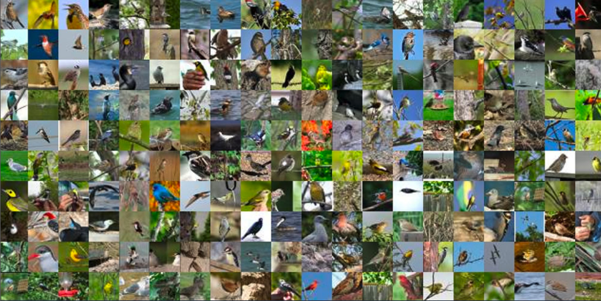

# Data Preparationg using SageMaker Processing

Amazon SageMaker Processing is a Managed Solution to Run Data Processing and Model Evaluation Workloads. Data processing tasks such as feature engineering, data validation, model evaluation, and model interpretation are essential steps performed by engineers and data scientists in this machine learning workflow. 

Your custom processing scripts will be containerized running in infrastructure that is created on demand and terminated automatically. You can choose to use a SageMaker optimized containers for popular data processing or model evaluation frameworks like Scikit learn, PySpark etc. or Bring Your Own Containers (BYOC).

---
# Introduction
Preprocess data before model training is an important step in the overall MLOps process. In this lab you will learn how to use [SKLearnProcessor](https://docs.aws.amazon.com/sagemaker/latest/dg/use-scikit-learn-processing-container.html), a type of SageMaker process uses Processcikit-learn scripts in a container image provided and maintained by SageMaker to preprocess data or evaluate models.

The example script will first Load the bird dataset, and then split data into train, validation, and test channels, and finally Export the data and annotation files to S3.

** Note: This Notebook was tested on Data Science Kernel in SageMaker Studio**

---
## Prerequisites

Download the notebook into your environment, and you can run it by simply execute each cell in order. To understand what's happening, you'll need:

- Access to the SageMaker default S3 bucket. All the files related to this lab will be stored under the "cv_keras_cifar10" prefix of the bucket.
- Familiarity with Python and numpy
- Basic familiarity with AWS S3.
- Basic understanding of AWS Sagemaker.
- Basic familiarity with AWS Command Line Interface (CLI) -- ideally, you should have it set up with credentials to access the AWS account you're running this notebook from.
- SageMaker Studio is preferred for the full UI integration

---

## Dataset
The dataset we are using is from [Caltech Birds (CUB 200 2011)](http://www.vision.caltech.edu/visipedia/CUB-200-2011.html) dataset contains 11,788 images across 200 bird species. Each species comes with around 60 images, with a typical size of about 350 pixels by 500 pixels. Bounding boxes are provided, as are annotations of bird parts. A recommended train/test split is given, but image size data is not.

Run the notebook to download the full dataset or download manually [here](https://course.fast.ai/datasets). Note that the file size is around 1.2 GB, and can take a while to download. If you plan to complete the entire workshop, please keep the file to avoid re-download and re-process the data.

---

# Review Outputs

At the end of the lab, your dataset will be randomly split into train, valid, and test folders.  YUou will also have a csv manifest file for each channel. **If you plan to complete other modules in this workshop, please keep these data.  Otherwise, you can clean up after this lab.**