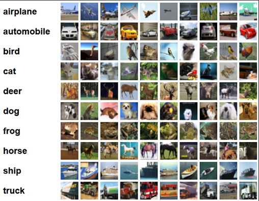

## Training a CV model on Amazon SageMaker

Training models is easy on Amazon SageMaker. You simply specify the location of your data in Amazon S3, define the type and quantity of ML instances you need, and start training a model with just a few line of code. Amazon SageMaker sets up a distributed compute cluster, performs the training, outputs the result to Amazon S3, and tears down the cluster when complete. 

---
## Introduction
This lab is focused on SageMaker Training for CV. We'll show an example for the performant Pipe Mode data ingestion, HyperParameter Optimization, as well as experiment tracking. In the future labs we'll show how experiment tracking can be automated through SageMaker Pipeline's native integration. The model used for this notebook is a simple deep CNN that is based on the [Keras examples](https://www.tensorflow.org/tutorials/images/cnn). 

At the end of this lab, you should develop hands on experience 1) training custom CV models on Amazon SageMaker, 2) Build Automatic Model Tuning Jobs, and 3) Organize your ML experimentation using SageMaker Experiments.

** Note: This Notebook was tested on Data Science Kernel in SageMaker Studio**

---
## Prerequisites

To get started, download the provided Jupyter notebook and associated files to you SageMaker Studio Environment. To run the notebook, you can simply execute each cell in order. To understand what's happening, you'll need:

- Access to the SageMaker default S3 bucket. All the files related to this lab will be stored under the "cv_keras_cifar10" prefix of the bucket.
- Familiarity with Python and numpy
- Basic familiarity with AWS S3.
- Basic understanding of AWS Sagemaker.
- Basic familiarity with AWS Command Line Interface (CLI) -- ideally, you should have it set up with credentials to access the AWS account you're running this notebook from.
- SageMaker Studio is preferred for the full UI integration

---

## Dataset
The [CIFAR-10 dataset](https://www.cs.toronto.edu/~kriz/cifar.html) is one of the most popular machine learning datasets. It consists of 60,000 32x32 images belonging to 10 different classes (6,000 images per class). Here are the classes in the dataset, as well as 10 random images from each:

