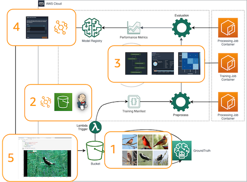
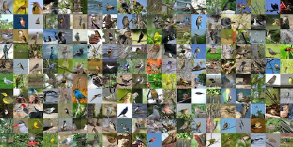

# End-to-end Edge Computer Vision (CV) Machine Learning (ML) Orchistration

## Introduction

In this workshop, we will walk you through a step by step process to prepare, build and train computer vision models with Amazon SageMaker and deploy them to AWS panorama for edge inference. The workshop image classification of different species of birds, but the concept can be applied to a wide range of industrial applications. We will complete the CV MLOps lifecycle covering: data labeling, continuous integrated (CI/CD) training pipeline, model updates to the edge w/ approval, and, fianlly, edge inferencing and data capture back to the cloud.

## Architecture

The architecture we will build during this workshop is illustrated on the right. Several key components can be highlighted:

1. **Data labeling w/ SageMaker GroundTruth**: We are using the CUB_MINI.tar data which is a subset of [Caltech Birds (CUB 200 2011)](http://www.vision.caltech.edu/visipedia/CUB-200-2011.html) dataset. The code below will spin up a GoundTruth labeling job for private/public workforce to label.  The output is a fully labeled manifest file that can be ingested by the atutomated training pipeline.

2. **Automated training Pipeline** Once the dataset is fully labelled, we have prepared a SageMaker pipeline that will go through steps: preprocessing, model training, model evaluation, and storing the model to model registry.  At the same time, the example code will provide advance topics like streaming data with pipe mode and fast file mode, monitor training with SageMaker debugger, and distributed training to increase training effeciency and reduce training time.

3. **Model Deployment & Edge Inferencing w/ AWS Panorama** With manual approval of the model in Model registry, we can kick off the edge deploymnet with a deployment lambda.  That can be accomplish using the AWS Panorama API.  We will also illustration the edge application development and testing using the AWSW Panorama Test Utility (Emulator)

---

## Prerequisites

To run this notebook, you can simply execute each cell in order. To understand what's happening, you'll need:

- Access to the SageMaker default S3 bucket or use your own
- The S3 bucket that you use for this demo must have a CORS policy attached. To learn more about this requirement, and how to attach a CORS policy to an S3 bucket, see [CORS Permission Requirement](https://docs.aws.amazon.com/sagemaker/latest/dg/sms-cors-update.html)
- The notebook use public workforce (Mechanical Turk) for the groundTruth labeling job. That will incur some cost at **$0.012 per image**.  If want to use a prviate workforce, then you must have a private workforce already created and update the code with your private workforce ARN. Please follow this [AWS documentation](https://docs.aws.amazon.com/sagemaker/latest/dg/sms-workforce-create-private-console.html) on how to create a private workforce
- Access to Elastic Container Registry (ECR)
- Familiarity with Training on Amazon SageMaker
- Familiarity with SageMaker Processing Job
- Familiarity with SageMaker Pipeline
- Familiarity with Python
- Familiarity with AWS S3
- Basic familiarity with AWS Command Line Interface (CLI) -- ideally, you should have it set up with credentials to access the AWS account you're running this notebook from.
- SageMaker Studio is preferred for the full UI integration

---

## Dataset
The dataset we are using is from [Caltech Birds (CUB 200 2011)](http://www.vision.caltech.edu/visipedia/CUB-200-2011.html) dataset contains 11,788 images across 200 bird species (the original technical report can be found here). Each species comes with around 60 images, with a typical size of about 350 pixels by 500 pixels. Bounding boxes are provided, as are annotations of bird parts. A recommended train/test split is given, but image size data is not.

The dataset can be downloaded [here](https://course.fast.ai/datasets). Note that the file size is around 1.2 GB, and can take a while to download. To make the download and training time reasonable, we will use a subset of the bird data. CUB_MINI.tar is attached in this workshop repo. It contains images and metadata for 8 of the 200 species, and can be used effectively for testing and learning how to use SageMaker and TensorFlow together on computer vision use cases.

* 13 (Bobolink)
* 17 (Cardinal)
* 35 (Purple_Finch)
* 36 (Noerhern_Flicker)
* 47 (American_Golsdi..)
* 68 (Ruby_throated_...)
* 73 (Blue_Jay)
* 87 (Mallard)

---
To help you understand and test each step of the training pipeline: 1) preprocess, 2) training/tuning, and 3) model evaluation.  3 seperate notebooks are provided which you can step through each.

- test-1-preprocess.ipynb
- test-2-training.ipynb
- test-3-evaluate.ipynb

---
## Edge Deployment