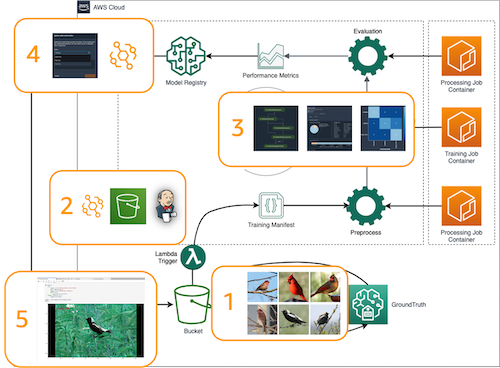
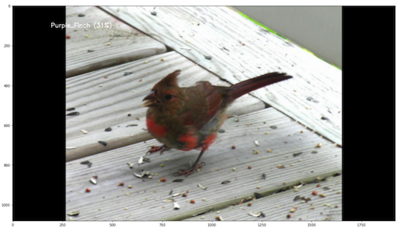
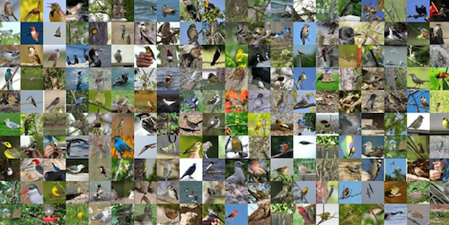

# End-to-end Edge Computer Vision (CV) Machine Learning (ML) Orchistration

## Introduction

In this module, you will walk through an end-to-end process of developing an enterprise Computer Vision(CV) solution. The module starts with data label, then move to training orchestration where you will prepare, train, and evaluate the models. If model performance meets your expectation, you will deploy it to an AWS panorama for edge inference. The CV example is predicting different species of birds, but technique and concepts are applicable to a wide range of industrial CV use cases.

---
## Folder Structure
- 1_training - End-to-end MLOps pipeline example.
- 2_deployment - Panorama application code to deploy to AWS Panorama device or simulate using the test untility.

## Architecture
---

The architecture we will build during this workshop is illustrated on the right. Several key components can be highlighted:

1. **Data labeling w/ SageMaker GroundTruth**: We are using the CUB_MINI.tar data which is a subset of [Caltech Birds (CUB 200 2011)](http://www.vision.caltech.edu/visipedia/CUB-200-2011.html) dataset. The code below will spin up a GoundTruth labeling job for private/public workforce to label.  The output is a fully labeled manifest file that can be ingested by the atutomated training pipeline.

2. **Automated training Pipeline** Once the dataset is fully labelled, we have prepared a SageMaker pipeline that will go through steps: preprocessing, model training, model evaluation, and storing the model to model registry.  At the same time, the example code will provide advance topics like streaming data with pipe mode and fast file mode, monitor training with SageMaker debugger, and distributed training to increase training effeciency and reduce training time.

3. **Model Deployment & Edge Inferencing w/ AWS Panorama** With manual approval of the model in Model registry, we can kick off the edge deploymnet with a deployment lambda.  That can be accomplish using the AWS Panorama API.  We will also illustration the edge application development and testing using the AWS Panorama Test Utility (Emulator)

---
### Setup Test Utility

Panorama Test Utility is a set of python libraries and commandline commands, which allows you to test-run Panorama applications without Panorama appliance device. With Test Utility, you can start running sample applications and developing your own Panorama applications before preparing real Panorama appliance. Sample applications in this repository also use Test Utility.

For more about the Test Utility and its current capabilities, please refer to [Introducing AWS Panorama Test Utility document](https://github.com/aws-samples/aws-panorama-samples/blob/main/docs/AboutTestUtility.md).

To set up your environment for Test Utility, please refer to **[Test Utility environment setup](https://github.com/aws-samples/aws-panorama-samples/blob/main/docs/EnvironmentSetup.md)**.

---

## Prerequisites

To run this notebook, you can simply execute each cell in order. To understand what's happening, you'll need:

- Access to the SageMaker default S3 bucket or use your own
- The S3 bucket that you use for this demo must have a CORS policy attached. To learn more about this requirement, and how to attach a CORS policy to an S3 bucket, see [CORS Permission Requirement](https://docs.aws.amazon.com/sagemaker/latest/dg/sms-cors-update.html)
- The notebook use public workforce (Mechanical Turk) for the groundTruth labeling job. That will incur some cost at **$0.012 per image**.  If want to use a prviate workforce, then you must have a private workforce already created and update the code with your private workforce ARN. Please follow this [AWS documentation](https://docs.aws.amazon.com/sagemaker/latest/dg/sms-workforce-create-private-console.html) on how to create a private workforce
- Access to Elastic Container Registry (ECR)
- Familiarity with Training on Amazon SageMaker
- Familiarity with SageMaker Processing Job
- Familiarity with SageMaker Pipelines
- Familiarity with Python
- Familiarity with AWS S3
- Basic familiarity with AWS Command Line Interface (CLI) -- ideally, you should have it set up with credentials to access the AWS account you're running this notebook from.
- SageMaker Studio is preferred for the full UI integration

---

## Dataset
The dataset we are using is from [Caltech Birds (CUB 200 2011)](http://www.vision.caltech.edu/visipedia/CUB-200-2011.html) dataset contains 11,788 images across 200 bird species. Each species comes with around 60 images, with a typical size of about 350 pixels by 500 pixels. Bounding boxes are provided, as are annotations of bird parts. A recommended train/test split is given, but image size data is not.

Run the code in the notebook to download the full dataset or download manually [here](https://course.fast.ai/datasets). Note that the file size is around 1.2 GB, and can take a while to download. If you plan to complete the entire workshop, please keep the file to avoid re-download and re-process the data.