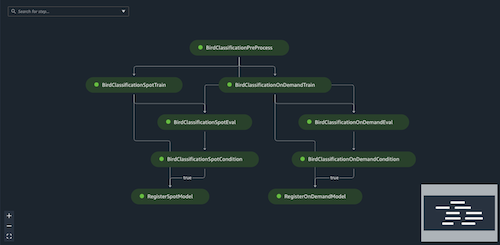
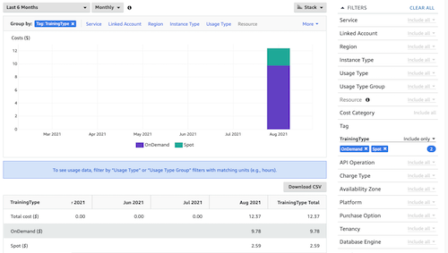
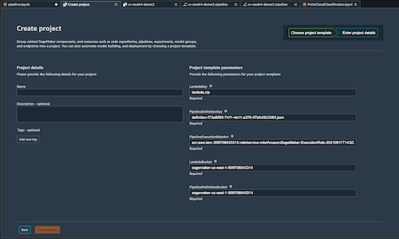

# Training Pipeline

Machine learning(ML) orchestration workflows is an important milestone to operationalize ML solutions for production. This usually entails connecting and automating various ML steps which include exploring and preparing data, experimenting with different algorithms and parameters, training and tuning models, and deploying models to production. This is why purpose-built tools like [SageMaker Pipelines](https://docs.aws.amazon.com/sagemaker/latest/dg/pipelines.html) and [SageMaker Projects](https://docs.aws.amazon.com/sagemaker/latest/dg/sagemaker-projects-whatis.html) are important to help you automate, manage, and standardize ML orchestration workflows, so you can quickly productionalize and scale your ML solutions.

---
# Introduction

This module demonstrates how to build a reusable computer vision (CV) workflow using SageMaker Pipelines. The pipeline goes through preprocessing, training, and evaluating steps for 2 different training jobs:1) Spot training and 2) On Demand training. If the accuracy meets certain requirements, the models are then registered with SageMaker Model Registry.

[SageMaker pipelines](https://aws.amazon.com/sagemaker/pipelines/) is the first purpose-built, easy-to-use continuous integration and continuous delivery (CI/CD) service for machine learning (ML). It works on the concept of steps. The order steps are executed in is inferred from the dependencies each step have. If a step has a dependency on the output from a previous step, it's not executed until after that step has completed successfully. This also allows SageMaker to create a Direct Acyclic Graph, DAG, that can be visuallized in Amazon SageMaker Studio (see diagram above). The DAG can be used to track pipeline executions, inputs/outputs and metrics, giving user the full lineage of the model creation.

This module will also illustrate the concept of Spot Training. The pipeline train two models (exactly same) in parallel, one using on-demand instances and the other uses spot instances. Training workloads are tagged accordingly: TrainingType: Spot or OnDemand. If you are interested and have permission to access billing of your AWS account, you can visualize the cost savings from spot training in your cost explore. To enable custom cost allocation tags, please follow this [AWS documentation](https://docs.aws.amazon.com/awsaccountbilling/latest/aboutv2/activating-tags.html). It takes 12-48 hrs for the new tag to show in your cost explore.

---

Optionally, you can also try SageMaker Project and building a repeatable pattern from your pipeline. It is a great way to standardize and scale ML solutions for your teams and organizations.

An Amazon SageMaker project template automates the set up and implementation of MLOps patterns. SageMaker already provides a set of project templates 
that create the infrastructure you need to create an MLOps solution for CI/CD of your ML models. [More on Provided Project Templates](https://docs.aws.amazon.com/sagemaker/latest/dg/sagemaker-projects-templates-sm.html) If the SageMaker provided templates do not meet your needs, you can also create your own templates.

For that, you need the pipeline definition file. It is a JSON file that defines a series of interconnected steps using Directed Acyclic Graph (DAG) and specifies the requirements and relationships between each step of your pipeline. This JSON file along with Cloudformation template also allows you to manage your pipeline and it's underline infrastructure as code, so you can establish re-usable CI/CD patterns to standardize among your teams.

A CloudFormation template `sagemaker-project.yaml` is supplied with this week's lab.

It will generate following resources:
* S3 bucket - with Lambda PUT notification enabled
* A lambda function - when triggered will create/update a SageMaker pipeline and execute it
* A SageMaker pipeline - generated from the JSON definition file
* A SageMaker Model Group - to house the complete models

Note: for lab purpose, we are loose with our role permissions.  You will likely use tighter permission control than what's provided.

To get started, load the provided Jupyter notebook and associated files to you SageMaker Studio Environment.

---

## Prerequisites

To run this notebook, you can simply execute each cell in order. To understand what's happening, you'll need:

- Access to the SageMaker default S3 bucket
- Access to Elastic Container Registry (ECR)
- For the optional portion of this lab, you will need access to CloudFormation, Service Catelog, and Cost Explore
- Familiarity with Training on Amazon SageMaker
- Familiarity with Python
- Familiarity with AWS S3
- Basic understanding of CloudFormaton and concept of deploy infra as code
- Basic understanding of tagging and cost governance
- Basic familiarity with AWS Command Line Interface (CLI) -- ideally, you should have it set up with credentials to access the AWS account you're running this notebook from.
- SageMaker Studio is preferred for the full UI integration

---
## Dataset
The dataset we are using is from [Caltech Birds (CUB 200 2011)](http://www.vision.caltech.edu/visipedia/CUB-200-2011.html) dataset contains 11,788 images across 200 bird species. Each species comes with around 60 images, with a typical size of about 350 pixels by 500 pixels. Bounding boxes are provided, as are annotations of bird parts. A recommended train/test split is given, but image size data is not.

Run the notebook to download the full dataset or download manually [here](https://course.fast.ai/datasets). Note that the file size is around 1.2 GB, and can take a while to download. If you plan to complete the entire workshop, please keep the file to avoid re-download and re-process the data.
