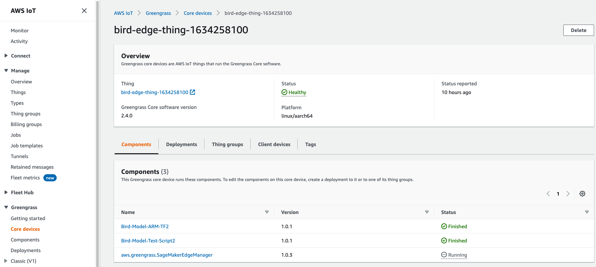

## Edge Deployment using SageMaker Edge Manager and IoT Greengrass v2

---

# Introduction

In this lab illustrate how you can optimize and deploy machine learning models for edge devices.

1. Use an ARM64 EC2 instance to mimic an typical ARM based edge device.
2. Config the edge device by installing Greengrass core to manage the edge deployment
3. Prepare our model for edge using SageMaker Neo and Edge Manager (either use the model from the previous modules or run the `optional-prepare-data-and-model.ipynb` notebook to create a new model)
4. Finally we will deploy a simple application that predicts a list of bird images and send the results to the cloud

** Note: This Notebook was tested on Data Science Kernel in SageMaker Studio**

---
# Prerequisites

Download the notebook into your environment, and you can run it by simply execute each cell in order. To understand what's happening, you'll need:

- Following Policy to your **SageMaker Studio Execution role** to properly executed this lab. Warning: the permissions set for this lab are very loose for simplicity purposes. Please follow the least privilege frame when you work on your own projects.   These permissions allow user to interact with other AWS services like EC2, System Manager (SSM), IoT Core, and GreengrassV2.

    - AmazonEC2FullAccess
    - AmazonEC2RoleforSSM
    - AmazonSSMManagedInstanceCore
    - AmazonSSMFullAccess
    - AWSGreengrassFullAccess
    - AWSIoTFullAccess
    
- Familiarity with Python
- Basic understanding of SSM
- Basic familiarity with AWS S3
- Basic familiarity with IoT Core
- Basic familiarity with GreengrassV2
- Basic familiarity with AWS Command Line Interface (CLI) -- ideally, you should have it set up with credentials to access the AWS account you're running this notebook from.
- SageMaker Studio is preferred for the full UI integration

---
## Prepare the Model for the Edge

You can use the bird model use created from the previous modules or run the `optional-prepare-data-and-model.ipynb` notebook to create a new model. Update the path to your model below if necessary.

---
## View Your Deployment in GreenGrass Console

1. Go to [Greengrass Console](https://console.aws.amazon.com/greengrass/)

2. View the deployment you just made in the deployment dashoboard
   
   - This shows you the deployment details: components, target devices, and deployment status
   - You can also see the device status to indicate the device is running in a healthy state.

3. Click inot Core device to get more detail on the device status
   - You can get status details on each components

