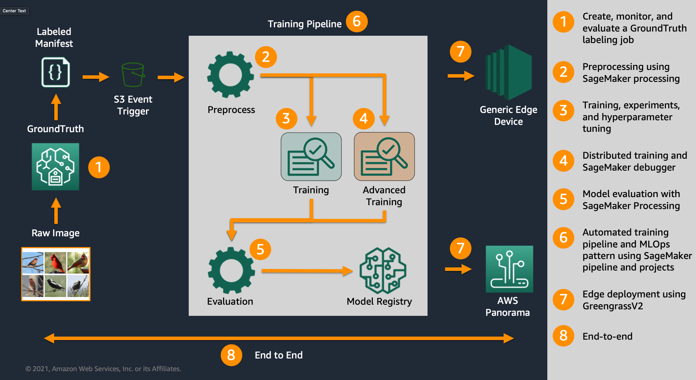

## End-to-end Computer Vision (CV) Training Workshop
---

This is an end-to-end CV MLOps workshop aimed to help Machine Learning (ML) and Data Science (DS) teams build relevant AWS and SageMaker competencies for an enterprise scale solution. The content is derived from a real world CV use case where an image classification model is developed and trained on SageMaker and then deployed to an edge computing devices. Here is a diagram overview of the workshop and the learning outcome for each module

The curriculum consists following modules:

1. [Data Labeling (Optional)](01_groundtruth(optional)/README.md)
2. [Preprocessing](02_preprocessing/README.md)
3. [Training on SageMaker](03_training/README.md)
4. [Advance Training on SageMaker](04_advanced_training/README.md)
5. [Model Evaluation and Model Explainability](05_model_evaluation_and_model_explainability/README.md)
6. [Sagemaker Trainning Pipeline](06_training_pipeline/README.md)
7. [Edge Deployment](07_edge_deployment/README.md)
8. [End-to-end](08_end-to-end/README.md)

To get started, load the provided Jupyter notebook and associated files to you SageMaker Studio Environment.

## Security

See [CONTRIBUTING](CONTRIBUTING.md#security-issue-notifications) for more information.

## License

This library is licensed under the MIT-0 License. See the LICENSE file.
